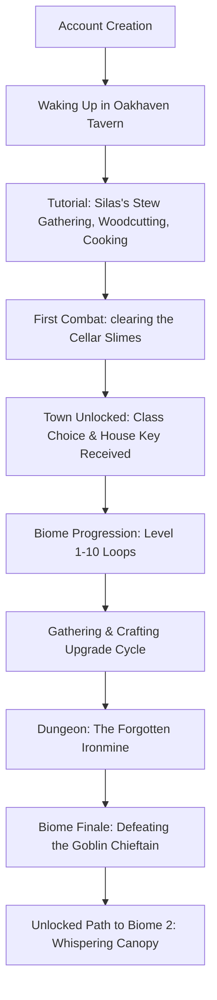

# Arcanora: Early Game & World Redesign Proposal
## First Biome: Eldoria Foothills & Oakhaven Hamlet

Welcome to the design proposal for the early-game overhaul of **Arcanora**. This document reimagines the player experience from account creation through the completion of the first biome, turning a node-based command structure into an immersive, interconnected sandbox RPG and tycoon simulation.

---

## 1. The Player's Journey: From Novice to Champion of the Foothills



### Phase 1: Waking Up (Levels 1–2)
The player starts as a **Novice** at the **Cozy Tavern** in **Oakhaven Hamlet**. Instead of reading a text wall, the player is immediately tasked by Silas the Tavern Keeper with a simple favor: fetch logs and catch a river trout for the nightly stew. This introduces basic travel, gathering, and cooking.

### Phase 2: Finding a Calling (Levels 3–5)
After clearing a minor infestation of cellar slimes (introducing combat), the player is recognized by Guard Captain Vaelen. Vaelen directs them to the Town Square, unlocking the **Quest Board** and granting them the key to their **Personal Cottage**. Upon reaching level 5, the player visits the Class Trainer to choose a specialized class (Warrior, Mage, Rogue, Ranger, Healer).

### Phase 3: The Gathering Storm (Levels 5–8)
The player establishes their **Personal Farm** to grow stamina-restoring crops (e.g., wheat, potatoes) and begins venturing into the **Eldoria Foothills**. They gather iron ore from the **Glittering Meadows** and chop oak logs in the **Birch Thicket** to craft upgraded weapons and armor at the Blacksmith.

### Phase 4: Down in the Depths (Levels 8–10)
To proceed past the Foothills, the player must clear the **Forgotten Ironmine** (the biome's first major dungeon). They navigate procedural paths, fight miners, mine deep-vein cobalt, and defeat the **Goblin Chieftain, Grak'Zul**, unlocking passage to the second biome: the **Whispering Canopy**.

---

## 2. Oakhaven Hamlet: The Starter Town Layout

Oakhaven Hamlet is the player's central hub. Rather than a flat list of text options, Oakhaven is structured as distinct locations that players travel between, each serving a unique progression purpose.

```
Oakhaven Hamlet (Starter Town)
├── Cozy Tavern (Silas, rest bed, cooking hearth, bulletin board)
├── Town Square & Quest Board (Vaelen, daily board, faction vendor)
├── The Marketplace (Merchant Joren, general goods, player auction block)
├── Oakhaven Forge (Ralph the Smith, smithing anvil, equipment repairs)
├── Apothecary Cottage (Alchemist Elara, herb press, potion shop)
├── River Docks (Fisherman Barnaby, bait shop, fishing spot)
└── Housing District (Instanced gate to Player's Personal Cottage & Farm)
```

| Location | Key NPC | Services Offered | Progression Role |
| :--- | :--- | :--- | :--- |
| **Cozy Tavern** | Innkeeper Silas | Rest (Stamina/HP regen), Tavern Cooking Hearth | Initial spawn, resting hub, early cooking recipes |
| **Town Square** | Captain Vaelen | Daily Quest Board, Class Trainer (Lv5 Class Select) | Central hub, main quest distribution, class change |
| **Marketplace** | Merchant Joren | Buy/Sell raw goods, Player-to-Player Trading | Economic outlet, raw material sales, equipment trading |
| **Oakhaven Forge** | Ralph the Smith | Smithing Anvil, Gear Repair, Gear Enhancement | Weapon/Armor crafting, equipment durability management |
| **Apothecary** | Alchemist Elara | Alchemy Mortar, Potion Shop, Herb Processing | Health/Mana/Stamina potion crafting, combat buffs |
| **River Docks** | Fisherman Barnaby | Bait Shop, Fishing Node, Fish Cleaning | Fish gathering, fishing gear upgrades, raw food source |
| **Housing District** | None (Gate) | Instanced access to Player's Home and Plot | Tycoon loop entry, crop farming, storage, building upgrades |

---

## 3. The Biome Node Map: Eldoria Foothills

Travel is represented as moving between adjacent nodes. The node map below dictates movement pathways. Each node represents a distinct ecosystem with unique resources, encounters, and level requirements.

```
                  [Cozy Tavern] (Lv1+)
                        │
                        ▼
                [Oakhaven Town Square] (Lv1+)
                  /     │      \
                 /      │       \
                ▼       ▼        ▼
       [River Docks]  [Market]  [Oakhaven Forge] (Lv1+)
                \       │       /
                 \      │      /
                  ▼     ▼     ▼
                [Oakhaven Town Gate] (Lv2+)
                        │
                        ▼
               [Glittering Meadows] (Lv2-4)
                 /              \
                ▼                ▼
         [Birch Thicket] (Lv4-6)  [Silverbrook River] (Lv3-5)
                │                │
                ▼                ▼
         [Goblin Outpost] (Lv6-8) [Shimmering Cave] (Lv5-7)
                \                /
                 ▼              ▼
               [Forgotten Ironmine] (Lv8-10, Dungeon)
                        │
                        ▼
             [Whispering Canopy Gate] (Biome 2 Unlocks at Lv10)
```

---

## 4. Explorable Locations: Details & Ecosystems

Each location has a specific level range, resource table, and encounter profile.

### Glittering Meadows (Level 2–4)
* **Description:** A sprawling meadow filled with wildflowers, copper veins, and wild flax.
* **Ecosystem:** Slimes, Wild Rabbits, Young Wolves.
* **Resources:** Copper Ore (Mining), Flax Fiber (Gathering), Wild Herbs (Gathering).
* **Secrets:** A hollow oak tree containing a rusty shield.

### Silverbrook River (Level 3–5)
* **Description:** A rushing river flowing from the mountains.
* **Ecosystem:** River Crabs, Giant Bullfrogs, Mud Sprites.
* **Resources:** River Trout, Silver Carp (Fishing), Clay (Gathering).
* **Secrets:** Deep pool requiring a special bait to lure out the River King.

### Birch Thicket (Level 4–6)
* **Description:** A dense stand of young trees, filled with wildlife and foraging nodes.
* **Ecosystem:** Wild Boars, Wood Goblins, Forest Sprites.
* **Resources:** Birch Wood (Woodcutting), Wild Berries (Gathering), Resin (Woodcutting).
* **Secrets:** A forgotten woodcutter's camp with a supply chest.

### Shimmering Cave (Level 5–7)
* **Description:** A dark, damp cavern where glowing mushrooms light the walls.
* **Ecosystem:** Cave Bats, Stone Golems, Shadow Beetles.
* **Resources:** Iron Ore (Mining), Luminous Mushrooms (Alchemy), Coal (Mining).
* **Secrets:** A hidden tunnel behind a rockfall leading to a chest of gems.

### Goblin Outpost (Level 6–8)
* **Description:** A makeshift wooden fort built by goblins raiding Oakhaven's trade roads.
* **Ecosystem:** Goblin Scouts, Goblin Warriors, Rabid Goblins.
* **Resources:** Scrap Wood (Gathering), Iron Scrap (Gathering), Cloth Scrap (Gathering).
* **Secrets:** A locked chest containing stolen Oakhaven supplies.

### Forgotten Ironmine (Level 8–10, Dungeon)
* **Description:** An abandoned mine overrun by the goblin clan and their tamed beasts.
* **Ecosystem:** Goblin Miners, Mine Spiders, Ironhide Boars.
* **Boss:** **Goblin Chieftain, Grak'Zul** (Level 10 Elite).
* **Resources:** Iron Ore, Cobalt Ore, Heavy Stone.

---

## 5. NPC Roles & Dialogues

NPCs have distinct personalities and change their dialogues as the player completes quests.

### Silas — Tavern Keeper
* **Role:** Innkeeper, quest-giver, rest administrator.
* **Initial Dialogue:** *"Welcome to the Cozy Tavern, friend! Sit by the fire, grab a bowl of stew, and let the road fade away."*
* **Quest Progress Dialogue:** *"Silas Senior used to say a full stomach is the best shield. Get me some river trout, and I'll cook you something to remember."*
* **Services:** Cozy Bed Rest (2-minute cooldown, full HP/Stamina recovery), Tavern Hearth Cooking.

### Captain Vaelen — Outpost Commander
* **Role:** Town protector, class progression mentor, quest board administrator.
* **Initial Dialogue:** *"Eyes sharp, novice. The Oakhaven guards can't protect everyone. If you want to survive outside these gates, you'd better learn to swing that sword."*
* **Services:** Daily Quest Board access, Class Trainer (unlocks at level 5).

### Ralph — Forge Master
* **Role:** Weaponsmith and armorsmith.
* **Initial Dialogue:** *"You call that a weapon? It's more toothpick than iron. Bring me copper ore and birch wood, and we'll forge you something real."*
* **Services:** Smithing Anvil (Weapons/Armor Crafting), Item Repairs (Gold cost based on durability loss), Gear Enhancement.

### Elara — Apothecary Alchemist
* **Role:** Brewer of tonics and potions.
* **Initial Dialogue:** *"Nature holds the cure for every wound, and the poison for every foe. Tread carefully, and respect the plants you harvest."*
* **Services:** Herb processing, Alchemy Station (Potion/Elixir crafting).

---

## 6. Tutorial Progression: "Learn by Doing"

The tutorial is structured as a 4-step interactive questline that introduces mechanics sequentially.

### Step 1: Waking Up (Quest: "A Warm Hearth")
* **Objective:** Talk to Innkeeper Silas.
* **Action:** `/npc talk npc_silas`
* **Dialogue:** Silas notices you look exhausted and gives you 10 Stamina. He asks you to gather 3 Oak Logs from the woodpile out back to keep the hearth burning.
* **Reward:** 50 EXP, 20 Gold.

### Step 2: The Harvest (Quest: "The Stew Secret")
* **Objective:** Gather 3 Birch Logs and 1 River Trout.
* **Action:** Travel to **River Docks** (`/travel river_docks`) and **Birch Thicket** (`/travel birch_thicket`). Use `/gather` in the thicket and `/fish` at the docks.
* **Dialogue:** Silas cleans the trout and teaches you the **Trout Stew** recipe.
* **Reward:** 100 EXP, **Trout Stew** (Consumable: restores 20 HP, 10 Stamina).

### Step 3: Cellar Infestation (Quest: "Rats in the Dark")
* **Objective:** Clear 3 Cellar Slimes in the Cozy Tavern Cellar.
* **Action:** `/travel tavern_cellar` and `/hunt` to fight slimes.
* **Dialogue:** Silas gives you a **Wooden Training Sword**. Combat teaches using presets (`/player preset`) or picking turns.
* **Reward:** 150 EXP, 50 Gold, **Apprentice Ring** (+5 Attack).

### Step 4: Out into the World (Quest: "Captain's Call")
* **Objective:** Speak to Guard Captain Vaelen in the Town Square.
* **Action:** `/travel town_square`, `/npc talk npc_vaelen`.
* **Dialogue:** Vaelen commends you for clearing the cellar, grants you the key to your **Housing Cottage**, and unlocks the Oakhaven gates.
* **Reward:** 200 EXP, **House Key**, **Starter Seed Bag** (Contains 5 Wheat Seeds).

---

## 7. Quest Progression: The Story of Eldoria Foothills

A linear story quest chain drives players through the biome, guiding them to upgrade their equipment, explore new zones, and tackle challenges.

```
Story Quest Chain:
[01: Begin] ──► [02: Outpost Supply] ──► [03: The River King] ──► [04: Goblin Raids] ──► [05: Underworld Entry] ──► [06: Grak'Zul's Fall]
```

### Quest 1: Outpost Supply (Level 3)
* **Giver:** Captain Vaelen.
* **Requirements:** Deliver 10 Birch Logs and 5 Copper Ore to Ralph the Blacksmith.
* **Dialogue:** *"Ralph needs materials to supply the watchtowers. Help him, and he'll help you."*
* **Reward:** 300 EXP, **Copper Pickaxe** (Increases Mining speed/yield).

### Quest 2: The River King (Level 5)
* **Giver:** Fisherman Barnaby.
* **Requirements:** Catch 1 River Trout (Quality or higher) and gather 5 Flax Fiber for a new fishing line.
* **Dialogue:** *"There's a beast in Silverbrook River. They call him the River King. Help me mend my line, and I'll teach you the secret of river baits."*
* **Reward:** 500 EXP, **Bamboo Fishing Rod** (Increases fishing efficiency), bait recipe.

### Quest 3: Goblin Raids (Level 6)
* **Giver:** Captain Vaelen.
* **Requirements:** Defeat 8 Goblin Scouts in the Goblin Outpost.
* **Dialogue:** *"The Goblins are scouting our gates. Drive them back before they burn our fields!"*
* **Reward:** 750 EXP, **Guardian Amulet** (+10 Defense).

### Quest 4: Underworld Entry (Level 8)
* **Giver:** Ralph the Blacksmith.
* **Requirements:** Craft a full set of **Copper Gear** (Copper Sword, Copper Breastplate, Copper Boots).
* **Dialogue:** *"The depths of the Forgotten Ironmine are pitch-black and teeming with monsters. Do not enter without proper plate. Forge it yourself, kid."*
* **Reward:** 1000 EXP, 3x **Stamina Potions**.

### Quest 5: Grak'Zul's Fall (Level 10)
* **Giver:** Captain Vaelen.
* **Requirements:** Enter the **Forgotten Ironmine** dungeon and defeat the **Goblin Chieftain, Grak'Zul**.
* **Dialogue:** *"Grak'Zul coordinates the raids. End his reign, and Oakhaven can breathe. The road east will be safe once more."*
* **Reward:** 2000 EXP, **Grak'Zul's Horn** (Rare Crafting Material), **Foothills Conqueror Title**, unlock travel to Biome 2.

---

## 8. Combat Progression & Environment Matching

Combat is tactical and zone-appropriate. Monsters scale in level and possess environment-specific behaviors.

### Grasslands & Meadows (Glittering Meadows)
* **Forest Sprite (Lv1-2):** Weak, heals itself for 10 HP when low. Drops: Sprite Dust, Flax.
* **Wild Rabbit (Lv2):** Fast speed, high dodge chance (15%). Drops: Rabbit Fur.
* **Young Wolf (Lv2-3):** High physical attack, inflicts "Bleed" (5 damage/turn for 3 turns). Drops: Wolf Hide, Sharp Fang.

### River Ecosystem (Silverbrook River)
* **River Crab (Lv3-4):** High Defense (shield), slow speed. Drops: Crab Shell, Crab Meat.
* **Giant Bullfrog (Lv4):** Stuns players for 1 turn using its tongue. Drops: Frog Legs, Slime.
* **Mud Sprite (Lv4-5):** Slows player speed, reduces crit rate. Drops: Mud Clump.

### Forest & Caves (Birch Thicket & Shimmering Cave)
* **Wood Goblin (Lv4-5):** Attacks twice per turn with dual daggers. Drops: Goblin Ear, Scrap Iron.
* **Forest Sprite (Lv5):** Casts sleep and evasion buffs. Drops: Sprite Dust, Birch Sap.
* **Stone Golem (Lv6-7):** Heavy defense, immune to bleed. Drops: Iron Ore, Coal.
* **Cave Bat (Lv5-6):** Attacks drain health (15% lifesteal). Drops: Bat Wing.

### Dungeon & Bosses (Forgotten Ironmine)
* **Goblin Miner (Lv8-9):** Throws explosives dealing fire damage. Drops: Iron Ore, Coal.
* **Mine Spider (Lv8-9):** Poisons players, dealing 10 damage/turn for 5 turns. Drops: Spider Web, Venom Sac.
* **Goblin Chieftain, Grak'Zul (Lv10 Boss):** Heavy attacks, calls 1 Goblin Scout at 50% HP. Uses "Ground Slam" dealing area/stamina damage. Drops: Grak'Zul's Horn, Cobalt Ore, Guild Seals.

---

## 9. Life Skills & Resource Gathering

Gathering resources is active and consumes Stamina, reward-scaling with specialized tools.

```
Mining ────────► Pickaxe ──► Copper Ore, Iron Ore, Coal, Gem Geodes
Woodcutting ───► Axe ──────► Oak Logs, Birch Logs, Pine Wood, Resin
Gathering ─────► Sickle ───► Flax Fiber, Wild Herbs, Mushrooms, Berries
```

* **Stamina Cost:** Standard gathering actions cost **2 Stamina**. Successful gathering awards 10 Life Skill EXP.
* **Tool Progression:**
  - **Flimsy Tools:** Baseline gathering (no bonuses).
  - **Copper Tools:** +15% yield rate, 5% chance to double gather.
  - **Iron Tools:** +30% yield rate, 10% chance to double gather, unlocks rare resources (e.g. Cobalt, Hardwood).

| Resource Node | Location | Required Tool | Drop Table (Common / Rare) |
| :--- | :--- | :--- | :--- |
| **Copper Vein** | Glittering Meadows | Pickaxe | Copper Ore (80%) / Raw Quartz (20%) |
| **Birch Tree** | Birch Thicket | Axe | Birch Logs (85%) / Sap (15%) |
| **Wild Flax** | Glittering Meadows | Sickle | Flax Fiber (90%) / Wild Seeds (10%) |
| **Glowing Fungi**| Shimmering Cave | Sickle | Luminous Mushrooms (80%) / Cave Moss (20%) |
| **Iron Deposit** | Forgotten Ironmine | Pickaxe | Iron Ore (75%) / Coal (20%) / Geode (5%) |

---

## 10. Crafting Progression

Crafting connects gathering to combat upgrades, allowing players to turn raw materials into items.

### Crafting Quality Roll Formula
When crafting, players roll a d100 modified by their **Luck** stat:
$$\text{Craft Roll} = \text{random}(1, 100) + (\text{Luck} \times 0.2)$$

* **Roll < 75:** Normal Quality (Item has base stats).
* **Roll 75–94:** Quality (+10% base stats, +1 enhancement slot).
* **Roll 95+:** Perfect (Double yield or +20% stats, +2 slots, named tag).

### Starter Biome Recipe Book

| Recipe Name | Category | Materials Required | Resulting Item |
| :--- | :--- | :--- | :--- |
| **Copper Sword** | Smithing | 10x Copper Ore, 3x Birch Logs | Weapon (+15 Attack) |
| **Copper Breastplate**| Smithing | 15x Copper Ore, 2x Flax Cloth | Chest (+20 Defense, +10 Max HP) |
| **Copper Greaves** | Smithing | 8x Copper Ore, 1x Flax Cloth | Boots (+10 Defense, +5 Speed) |
| **Flaxen Robe** | Tailoring | 12x Flax Cloth, 2x Sprite Dust | Chest (+10 Defense, +30 Max Mana) |
| **Birch Bow** | Woodworking | 5x Birch Logs, 4x Flax Thread | Weapon (+12 Attack, +5 Speed) |
| **Trout Stew** | Cooking | 2x River Trout, 1x Wild Herbs | Consumable (+20 HP, +10 Stamina) |
| **Healing Salve** | Alchemy | 3x Wild Herbs, 1x Sap | Consumable (Heals 40 HP over 3 turns) |

---

## 11. Fishing Progression

Fishing is a relaxing activity that provides raw cooking ingredients and crafting supplies.

```
/fish (costs 3 Stamina)
 ├── Cast line (waits for bite cooldown: 5-15s)
 ├── Bite notification
 └── Hook action (requires button press)
```

### Water Bodies & Fish Tables
* **Silverbrook River (Docks):**
  - *Common:* River Trout (Restores 10 HP), Mud Crab (Restores 5 HP).
  - *Rare:* Silver Carp (Used in high-tier stew), River Eel (Alchemy component).
* **Shimmering Cave Pool:**
  - *Common:* Blind Cavefish (Used for Mana recipes).
  - *Rare:* Glow-in-the-dark Jellyfish (Produces glowing dye for housing).

### Bait System
Bait can be crafted using Alchemy or bought from Barnaby at the docks.
* **No Bait:** Base catches only.
* **Earthworms:** Crafted from soil/weeds. +20% bite rate.
* **Glowing Paste:** Crafted from Luminous Mushrooms. +40% chance of catching Cavefish or rare specimens.

---

## 12. Housing System: The Player's Private Estate

Every player is granted an instanced **Personal Cottage** upon reaching level 5. This zone is accessed via `/house` and is separate from public channels.

```
Player's Cottage Layout
┌──────────────────────────────────────┐
│                                      │
│    [Private Cottage] (Upgradable)    │
│      ├── Storage Chests              │
│      └── Rest Bed                    │
│                                      │
│    [Crafting Workshops]              │
│      ├── Loom & Spinning Wheel       │
│      └── Kitchen Range               │
│                                      │
│    [The Farm Plot]                   │
│      └── 4x Soil Beds (Upgradable)   │
└──────────────────────────────────────┘
```

### Cottage Tier Upgrades
Upgrading the house increases storage capacity, farm size, and unlocks building options.

* **Tier 1: Rustic Shack (Cost: Free via Quest)**
  - Storage: 10 item slots.
  - Farm: 2 crop plots.
  - rest bed bonus: +5% HP recovery rate.
* **Tier 2: Cozy Cottage (Cost: 1,500 Gold, 20x Birch Logs, 10x Copper Bars)**
  - Storage: 25 item slots.
  - Farm: 4 crop plots.
  - rest bed bonus: +10% HP recovery rate, stamina regen rate boosted.
  - Unlocks: Private Loom/Spinning Wheel.
* **Tier 3: Stone Homestead (Cost: 5,000 Gold, 50x Iron Bars, 50x Oak Logs, 20x Gems)**
  - Storage: 50 item slots, dedicated vault.
  - Farm: 8 crop plots, 1 Orchard Tree slot.
  - rest bed bonus: +20% HP/Mana recovery, stamina regen boosted.
  - Unlocks: Personal Cooking Hearth, Alchemy Laboratory.

---

## 13. Farming System: The Tycoon Engine

Players manage a personal farm plot connected to their house, producing ingredients for cooking, alchemy, and trade.

```
Farm Loop:
Buy/Find Seeds ──► Plant on Plot ──► Water (costs 1 Stamina) ──► Wait (Real Time) ──► Harvest (EXP & Crop)
```

### Crop Database

| Crop | Seed Cost | Growth Time | Harvesting Yield | Usage |
| :--- | :--- | :--- | :--- | :--- |
| **Wheat** | 10 Gold | 1 Hour | 3-5x Wheat | Ground into flour for Cooking (Bread, Stews) |
| **Potatoes** | 15 Gold | 2 Hours | 2-4x Potatoes | Used in hearty stews for high Stamina restore |
| **Flax** | 20 Gold | 3 Hours | 4-6x Flax Fiber | Spun into cloth at the loom for Tailoring |
| **Nightshade**| 50 Gold | 6 Hours | 1-2x Nightshade | Toxic herb used in Rogue weapon poison and Alchemy |
| **Apple Tree**| 500 Gold | 24 Hours | 8x Apples (Daily) | High-value food, vinegar production, trading |

---

## 14. Resting Mechanics: Staying Energized

Resting is a crucial loop in Arcanora. Action execution consumes Stamina. If a player runs out of Stamina, they cannot gather resources, explore, or hunt.

### Rest Methods & Bonuses

* **Campfire Rest (`/rest campfire`):**
  - *Location:* Can be built in any Wilderness zone using 3x Birch Logs.
  - *Effect:* Restores 5 Stamina and 10 HP per real-time minute. Lasts 10 minutes.
* **Tavern Rest (`/rest tavern`):**
  - *Location:* Cozy Tavern or Verdant Outpost.
  - *Effect:* Restores all HP, Mana, and Stamina.
  - *Cooldown:* 2 minutes (database-enforced).
* **Home Bed Rest (`/rest home`):**
  - *Location:* Player's instanced house.
  - *Effect:* Restores all stats.
  - *Bonus:* Grants a 1-hour **"Rested" Buff** (+10% EXP gain, +5 Speed) based on house tier.

---

## 15. The Core Gameplay Loop

Arcanora's loop is interconnected, ensuring that every activity supports another.

```
                  ┌────────────────────────┐
                  │        EXPLORE         │
                  │   Travel nodes, hunt   │
                  │  enemies, clear runs   │
                  └───────────┬────────────┘
                              │ Drops loot & gear
                              ▼
                  ┌────────────────────────┐
                  │        HARVEST         │
                  │ Mining, Woodcutting,   │
                  │   Fishing, Farming     │
                  └───────────┬────────────┘
                              │ Raw materials
                              ▼
                  ┌────────────────────────┐
                  │         CRAFT          │
                  │ Weapons, gear, stews,  │
                  │    potions, elixirs    │
                  └───────────┬────────────┘
                              │ Upgraded equipment & buffs
                              ▼
                  ┌────────────────────────┐
                  │        PROGRESS        │
                  │ Level up, build cottage│
                  │  upgrade farm tycoon   │
                  └───────────┬────────────┘
                              │ Unlocks higher nodes
                              └────────────────────────┘
```

---

## 16. Making the World Feel Alive in Discord

To move away from plain, menu-driven command outputs, we propose several Discord UI/UX practices:

### A. Dynamic Maps using Custom Emojis
Instead of listing connection names as text, render a map visual or travel interface using custom emojis and status indicators.
* **Example:**
```
🗺️ [Oakhaven Hamlet] ───🛣️─── 🟩 [Glittering Meadows] 
        │                                 │
        🛶                                🌲
        ▼                                 ▼
 🌊 [Silverbrook River]          🪓 [Birch Thicket] (🔒 Level 4 Required)
```

### B. Ambient Event Encounters
When traveling between locations, trigger a random **Ambient Event** that does not require combat but offers flavor and choice.
* **The Lost Merchant:** *"A trade carriage has lost a wheel. Do you help them?"*
  - **Option 1 (Help):** Costs 10 Stamina. Earns 100 Gold and +10 Reputation.
  - **Option 2 (Ignore):** No cost.
* **Fairy Ring:** *"You spot a circle of glowing mushrooms in the thicket."*
  - **Option 1 (Step inside):** 50% chance to gain +10 Mana Max buff for 1 hour; 50% chance to teleport randomly to Cozy Tavern.

### C. Visual Embeds & Themed Progress Bars
Upgrade all embeds to include themed UI headers, and make sure action buttons feel tactile.
* **Example Embed Design (Profile):**
```
━━━━━━━━━━━━━━━━━━━━━━━━━━━━━━━━━━━━━━━━━━━━━━━━━━
⚔️ PLAYER PROFILE: Arcanist Valen ⚔️
━━━━━━━━━━━━━━━━━━━━━━━━━━━━━━━━━━━━━━━━━━━━━━━━━━
Level: 5 Novice | EXP: 🟨🟨🟨🟨🟨⬜⬜⬜⬜⬜ [450 / 1000]
HP:     🟥🟥🟥🟥🟥🟥🟥⬜⬜⬜ [70 / 100]
Mana:   🟦🟦🟦🟦🟦🟦🟦🟦🟦⬜ [45 / 50]
Stamina:🟪🟪🟪🟪⬜⬜⬜⬜⬜⬜ [40 / 100] (Regen: +5 / 5m)

📍 Current Location: Cozy Tavern (Settlement)
🏠 House: Tier 1 Cottage | Farm: 2 plots seeded (Wheat)
━━━━━━━━━━━━━━━━━━━━━━━━━━━━━━━━━━━━━━━━━━━━━━━━━━
[ 📋 Quest Log ]   [ 💼 Open Bag ]   [ 🛏️ Rest in Bed ]
```

This proposal establishes a solid foundation that can scale to future biomes. By utilizing existing registries and expanding database structures (like players, inventory, and introducing a farming table), Arcanora becomes a living, breathing fantasy world.
